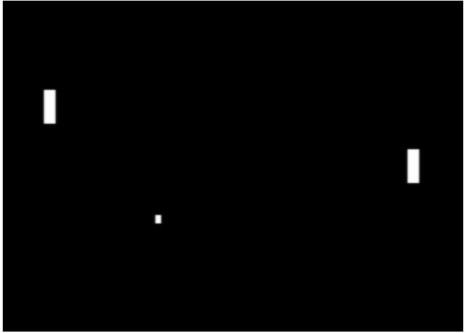
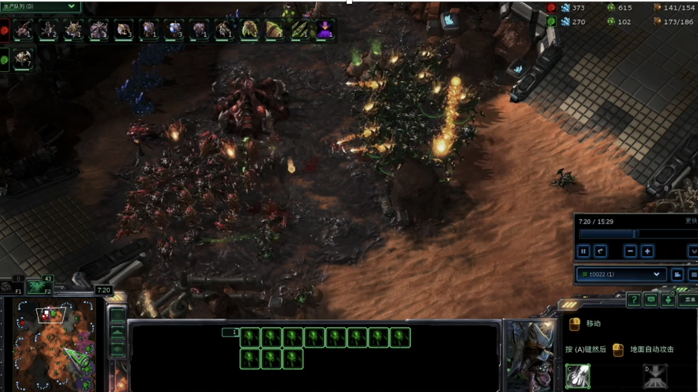
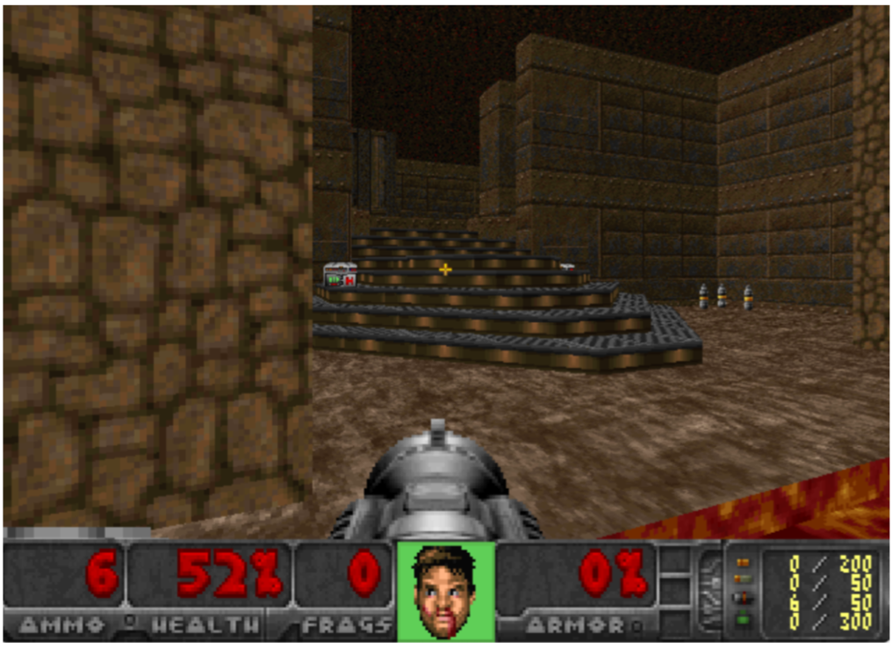
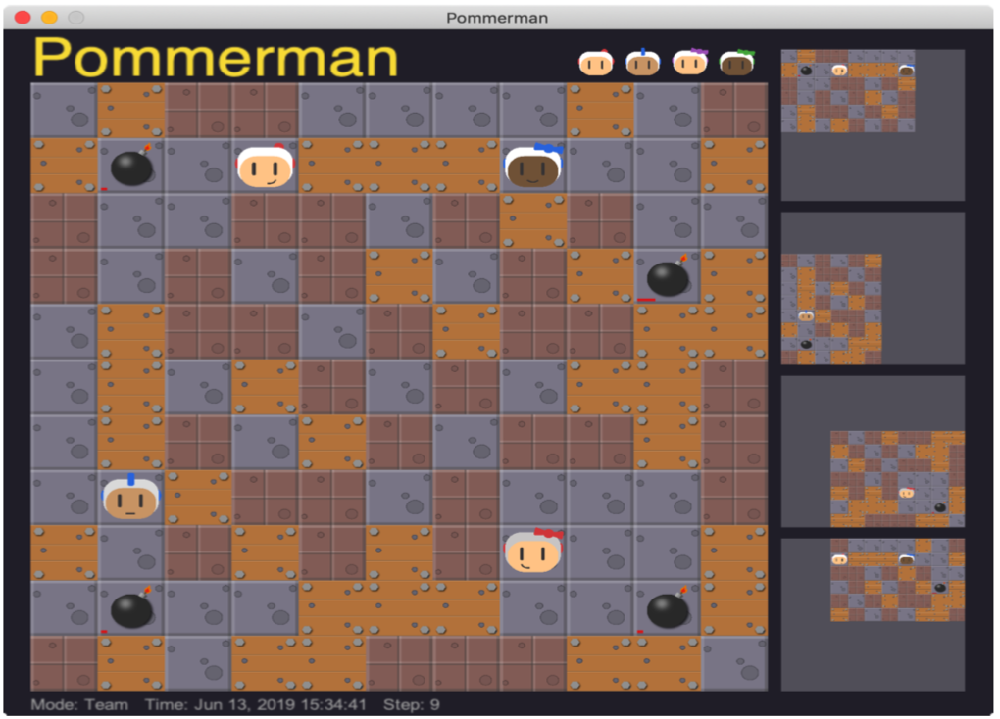
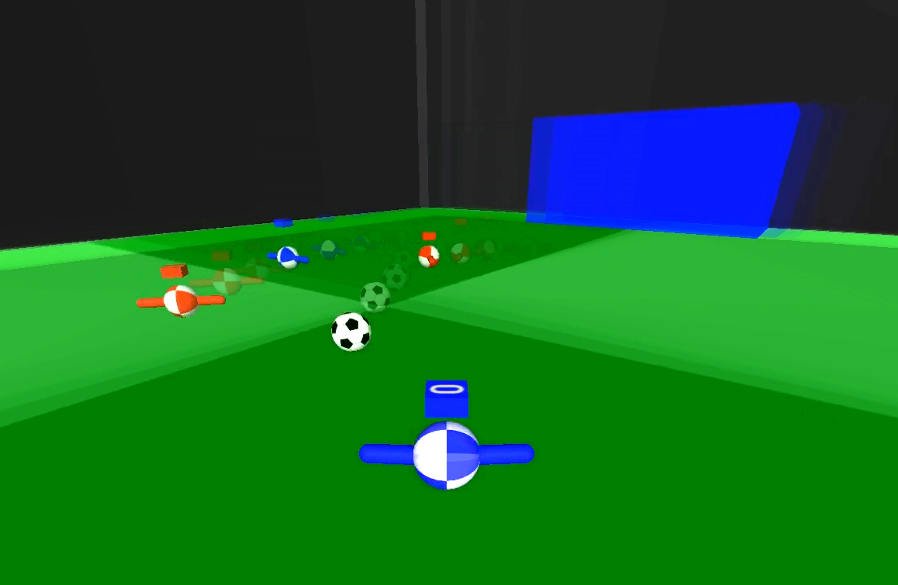
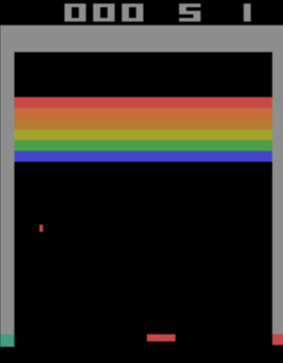
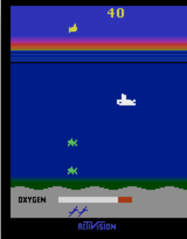
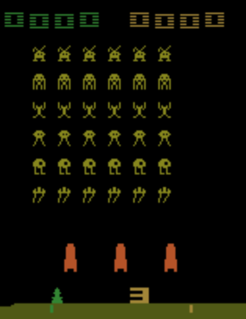

# Examples that Run in a Single Machine
We provide examples for how to run CSP-MARL training in a single machine for a couple of benchmark environments.

## Pong-2p


Pong-2p is a simple environment that is good for sanity check.
It is a two-agent competitive game for pong.
For each agent,
the observation is a (84, 84, 4) stacked image of screen pixels,
and the action is Discrete(6).
See Appendix I of https://arxiv.org/abs/1907.09467

See the following examples for training with Pong-2p:
* [SelfPlay+PPO](EXAMPLE_PONG2P_SP_PPO.md)

## StarCraft II


See the following:
* [SelfPlay+PPO2](EXAMPLE_SC2_SP_PPO2.md)
* [SelfPlay+PPO+InfServer](EXAMPLE_SC2_SP_PPO_INFSERVER.md)
* [SelfPlay+Vtrace](EXAMPLE_SC2_SP_VTRACE.md)

See the following examples for Imitation Learning:
* [IL](EXAMPLE_SC2_IL.md)
* [IL+InfServer](EXAMPLE_SC2_IL_INFSERVER.md)

## ViZDoom


See the following:
* [SelfPlay+PPO](EXAMPLE_VD_SP_PPO.md)

## Pommerman


See the following:
* [PFSP+PPO](EXAMPLE_POM_PFSP_PPO.md)
* [PFSP+PPO](EXAMPLE_POM_PFSP_PPO_INFSERVER.md)

## Soccer


Soccer is a multi-agent environment with continuous control.
To run the soccer examples, 
one should additionally install [dm_control](https://github.com/deepmind/dm_control) when installing `Arena`,
see the `Arena` [docs here](https://github.com/tencent-ailab/Arena#dependencies). 

See the following:
* [SelfPlay+PPO](EXAMPLE_SOCCER_SP_PPO.md)

## Single Agent RL
TLeague also works for pure RL,
which can be viewed as a special case of MARL where the number of agents equals to one.

### Gym Atari
  

Here we provide examples for how TLeague trains with Atari based on `gym`.
Make sure you've installed the correct dependencies, e.g.,
```bash
pip install gym[atari]==0.12.1
```

See the following:
* [PPO](EXAMPLE_GYM_ATARI_PPO.md)

**NOTE**: the purpose of these examples are to show how TLeague trains in the case of single agent RL.
To get reasonable performance, one needs careful preprocessings.
Refer to the [`open/baselines`](https://github.com/openai/baselines) code, 
as well as the [paper here](https://arxiv.org/abs/2005.12729).

## Terminology
Through all the examples above, we use the terminology:
* `unroll_length`: how long the trajectory is when computing the RL Value Function using bootstrap. It must be a multiple of `batch_size`.
* `rollout_length`: the length for RNN BPTT. `rollout_length`= `rollout_len` in the `policy_config`.
* `rm_size`: size for Replay Memory. It must be a multiple of `unroll_length`.